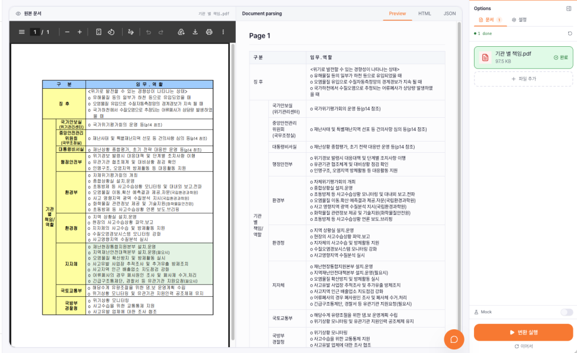
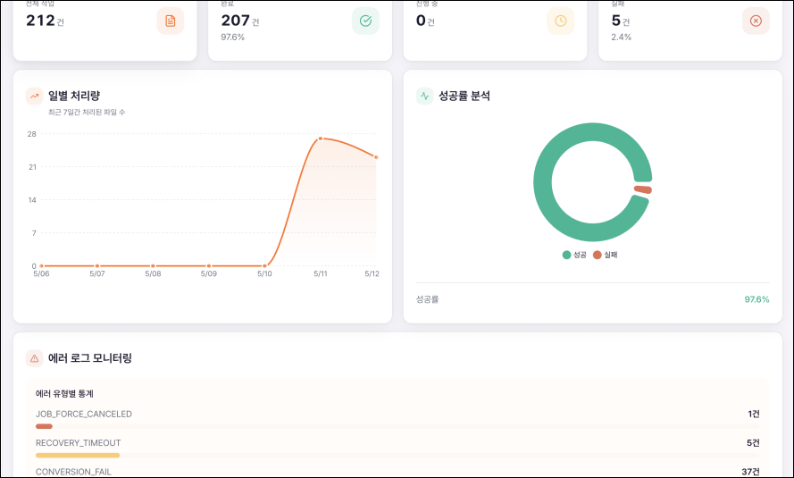
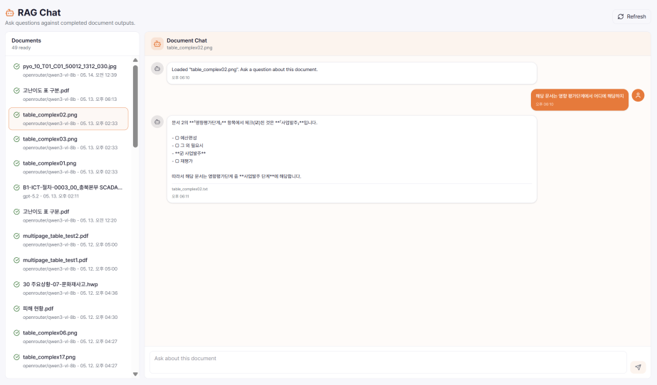

[](https://classroom.github.com/a/Lvs6kcL8)


<p align="center">
  
  안녕하세요. 여기는 2026년도 캡스톤 23조 Durmon:t의 GitHub입니다.
</p>

<br />

## ᕱ‬ Durmon:t ‪ᕱ

<p align="center">
  <strong>From Complex Documents to AI-Ready Knowledge</strong>
</p>

<p align="center">
  Durmon:t는 복잡한 문서를 AI가 이해할 수 있는 구조로 변환하고, 검색과 질의응답까지 연결하는 문서 AI 기술을 만듭니다.
</p>

### 팀원 소개

<table>
  <tr>
    <td align="center" width="180px">
      
      <br />
      <strong>김동연</strong>
      <br />
      PM & Full Stack
      <br />
      <a href="https://github.com/0yeonnnn0">GitHub</a>
    </td>
    <td align="center" width="180px">
      
      <br />
      <strong>강아영</strong>
      <br />
      AI
      <br />
      <a href="https://github.com/kaye0ng">GitHub</a>
    </td>
    <td align="center" width="180px">
      
      <br />
      <strong>김동진</strong>
      <br />
      Frontend
      <br />
      <a href="https://github.com/K-Dongjin">GitHub</a>
    </td>
    <td align="center" width="180px">
      
      <br />
      <strong>박가현</strong>
      <br />
      Backend
      <br />
      <a href="https://github.com/gahyeon1022">GitHub</a>
    </td>
    <td align="center" width="180px">
      
      <br />
      <strong>배경준</strong>
      <br />
      Backend
      <br />
      <a href="https://github.com/jun-kookmin">GitHub</a>
    </td>
    <td align="center" width="180px">
      
      <br />
      <strong>하승준</strong>
      <br />
      Backend & AI
      <br />
      <a href="https://github.com/seunG-Zzun">GitHub</a>
    </td>
  </tr>
</table>

<br />

## LLMong

문서를 AI 기반으로 구조화하여 RAG 검색 및 질의응답에 최적화된 데이터로 전환하는 문서 파싱 서비스입니다.
HWP/HWPX, PDF, 이미지, Excel 문서를 업로드하면 텍스트, 표, 이미지, 메타데이터를 추출하고, 검색 가능한 지식 데이터로 변환합니다.

<p align="center">
  
</p>

<br />

## 프로젝트 소개

**LLMong**은 다양한 형식의 업무 문서를 AI가 활용할 수 있는 구조화 데이터로 변환하는 문서 파싱 서비스입니다.
복잡한 문서 포맷과 레이아웃을 분석해 텍스트, 표, 이미지, 메타데이터를 추출하고, RAG 검색과 질의응답에 연결할 수 있는 데이터 흐름을 제공합니다.

<br />

## 서비스 개발 배경

LLM과 RAG를 업무 문서에 활용하려면 사내 문서를 단순 보관 파일이 아니라 **검색 가능한 데이터**로 정리하는 과정이 필요합니다.

하지만 실제 회사에서 사용하는 업무 문서는 **HWP, PDF, 스캔 이미지, 표, 차트, 수식**처럼 형식이 다양하고 레이아웃이 복잡해, 일반적인 텍스트 추출만으로는 **RAG 검색에 바로 사용할 수 있는 데이터**로 변환하기 어렵습니다.
**LLMong**은 이러한 문서를 자동으로 구조화해 **RAG 검색에 사용 가능한 데이터**를 만들기 위해 개발되었습니다.

<p align="center">
  
</p>

<p align="center">
  
</p>

<p align="center">
  
</p>

<br />

## 문서 파서와 RAG란?

### 문서 파서란?

문서 파서는 HWP, PDF, 이미지처럼 서로 다른 형식의 문서에서 **텍스트, 표, 이미지, 메타데이터**를 추출하고, 검색과 분석에 사용할 수 있는 **구조화 데이터**로 바꾸는 처리 모듈입니다.

LLMong은 문서 구조를 추출하는 데서 끝나지 않고, 표와 이미지 같은 비정형 요소까지 RAG 검색과 질의응답에 활용 가능한 데이터로 변환하는 것을 목표로 합니다.

<p align="center">
  
</p>

### RAG란?

**RAG(Retrieval-Augmented Generation)**는 LLM이 답변을 생성하기 전에 사내 문서나 데이터베이스에서 질문과 관련된 정보를 먼저 검색하고, 그 검색 결과를 근거로 답변을 만드는 방식입니다.

정확한 RAG 검색을 위해서는 문서가 단순 파일 상태가 아니라 **chunk, 메타데이터, 표 구조, 이미지 설명**처럼 검색 가능한 데이터로 정리되어 있어야 합니다.

변환된 문서는 chunk 단위로 분리되고, embedding을 생성해 벡터 검색에 사용할 수 있습니다.

사용자가 질문하면 관련 chunk를 먼저 검색한 뒤, 검색된 문맥을 기반으로 답변을 생성합니다.

답변은 원문 문서의 텍스트, 표, 이미지 설명을 함께 참조할 수 있어 단순 키워드 검색보다 정확한 문서 기반 질의응답이 가능합니다.

**RAG 기반 질의응답**을 통해 사용자는 업로드한 문서의 내용을 자연어로 검색하고, 관련 문맥을 반영한 답변을 받을 수 있습니다.

<p align="center">
  
</p>

<br />

## 주요 목표

- HWP/HWPX, PDF, 이미지, Excel 문서에서 텍스트, 표, 이미지, 메타데이터 추출
- 추출 결과를 .txt, 구조화 메타데이터, HTML, Markdown 표 형식으로 변환
- API 방식과 온프레미스 방식 모두 지원하는 문서 처리 구조 제공
- VLM 기반으로 표, 차트, 플로우차트, 수식 이미지를 유형별로 구조화
- 변환된 문서를 chunk와 embedding 기반 RAG 검색에 사용할 수 있는 데이터로 정리
- 업로드한 문서를 기반으로 자연어 질의응답 제공

<br />

## 주요 기능

### 1. AI 문서 파싱 / 변환

**HWP/HWPX, PDF, 이미지, Excel** 문서를 업로드하면 텍스트, 표, 이미지, 메타데이터를 추출합니다.

추출 결과는 .txt, 구조화 메타데이터, HTML, Markdown 표 형식으로 변환되어 **검색, 요약, RAG**에 바로 활용할 수 있습니다.

변환된 결과는 문서 단위로 확인할 수 있으며, 필요한 출력 형식으로 저장해 **RAG 검색 시스템**에 연결할 수 있습니다.

### 2. API 및 온프레미스 문서 처리 구조

**API 연계 방식**으로 기존 서비스와 연결할 수 있고, **온프레미스 방식**으로 사내망 또는 로컬 서버에 직접 배포할 수 있습니다.

온프레미스 방식에서는 민감한 문서를 외부로 내보내지 않고 내부 인프라에서 처리합니다.

온프레미스 내부 처리는 **qwen_doc → qwen_infer → qwen_finalize** 단계로 분리되어 동작합니다.

문서 전처리, VLM 추론, 결과 병합/정제를 분리해 대용량 문서도 작업 상태를 추적하며 안정적으로 처리합니다.

모델은 워커에서 한 번 로딩한 뒤 재사용하고, **GPU 동시 추론 수를 제한**해 VRAM 초과를 방지합니다.

### 3. VLM 기반 문서 구조화 파이프라인

PDF는 텍스트 블록, 이미지 영역, 표 후보, 페이지 렌더링 결과를 분리 처리해 단순 OCR보다 문서 구조를 더 안정적으로 복원합니다.

이미지 기반 문서는 VLM으로 **TABLE, CHART, FLOWCHART, MATH, IMAGE** 유형을 먼저 분류하고, 유형별 프롬프트를 적용해 구조화 정확도를 높입니다.

표 이미지는 셀 구조를 복원해 **HTML 테이블과 Markdown 테이블**로 변환하고, 차트는 축, 범례, 수치, 추세를 텍스트로 요약합니다.

플로우차트는 노드와 연결 관계를 단계별 흐름으로 정리하고, 수식 이미지는 LaTeX 또는 설명형 텍스트로 변환할 수 있습니다.

### 4. 문서 기반 RAG 질의응답

변환된 문서는 chunk 단위로 분리되고, embedding을 생성해 벡터 검색에 사용할 수 있습니다.

사용자가 질문하면 관련 chunk를 먼저 검색한 뒤, 검색된 문맥을 기반으로 답변을 생성합니다.

답변은 원문 문서의 텍스트, 표, 이미지 설명을 함께 참조할 수 있어 단순 키워드 검색보다 정확한 문서 기반 질의응답이 가능합니다.

**RAG 기반 질의응답**을 통해 사용자는 업로드한 문서의 내용을 자연어로 검색하고, 관련 문맥을 반영한 답변을 받을 수 있습니다.

<br />

## 기능 소개

LLMong은 문서 업로드부터 변환 결과 확인, 문서 기반 RAG 질의응답까지 하나의 흐름으로 사용할 수 있도록 구성되어 있습니다.

<p align="center">
  
</p>

<br />

## 데모 및 프리뷰

### 문서 변환

<p align="center">
  
</p>

### 변환 결과 보기

<p align="center">
  
</p>

### RAG 질의응답

<p align="center">
  
</p>

<br />

## 시스템 아키텍처

<p align="center">
  
</p>

<br />

## 프로젝트 구조

```text
cap_be/
  docker-compose.yml              # 일반 실행: frontend, backend, worker-openai, recovery, redis, rabbitmq
  docker-compose.onprem.yml       # 온프레미스 GPU 실행: staged Qwen workers 포함
  readme.md                       # 루트 실행 가이드

  backend/
    Dockerfile
    requirements.txt              # FastAPI, 문서 처리, 큐/스토어 기본 의존성
    requirements-torch.txt        # PyTorch/CUDA 고정 버전
    requirements-qwen.txt         # Qwen 로컬 추론 의존성
    pyproject.toml

    api/                          # FastAPI 앱, 라우터, 인증, API 서비스
      routers/                    # health, auth, parser, documents, dashboard, rag 등
      services/                   # 업로드 보안, 문서 저장, 배치 작업, 인증 서비스
      admin_ui/                   # Starlette Admin 기반 운영 UI

    core/                         # 파싱 파이프라인, Qwen/OpenAI client, RAG, 설정, 스케줄러
      jobs/                       # job 상태 전이, staged Qwen task 관리
      documents/                  # 문서 레코드, 저장, HWPX preview

    worker/                       # worker 실행 진입점과 복구/heartbeat/재시도 로직
    infra/                        # queue, store, storage adapter, progress event
    db/                           # SQLAlchemy 모델, seed, migration 보조 코드
    storage/                      # SQLite 기반 파일/KV 저장소
    eval/                         # 파서 평가 스키마, runner, metric
    tests/                        # backend 단위/API 테스트
    docs/                         # 설치, Qwen, worker routing 등 상세 문서
    data/                         # 로컬 입력/출력/tmp 기본 경로

  frontend/
    Dockerfile
    package.json
    nginx.conf                    # Docker 배포 시 /api, /ws 프록시
    src/
      app/                        # 전역 provider, theme, app state
      routes/                     # TanStack Router route 정의
      pages/                      # 화면 단위 페이지
      widgets/                    # 화면 조합 UI
      features/                   # 기능 단위 UI/model
      entities/                   # domain API query와 model
      shared/                     # 공통 UI, API client, lib, type
    e2e/                          # Playwright E2E 테스트
    docs/                         # frontend 개발 문서
```

<br />

## 🛠 기술 스택

### Frontend

   

### Backend

    

### AI

  

### Deployment

  

### Collaboration

  

<br />

## 🖥 개발 환경

| 분류 | 기술 |
| --- | --- |
| OS | Windows 11 / macOS / Ubuntu Linux |
| Frontend | React, TypeScript, Vite, Tailwind CSS |
| Backend | Python 3.12+, FastAPI, SQLite, Redis, RabbitMQ |
| AI | OpenAI, Qwen, OpenRouter |
| Queue | RabbitMQ |
| Cache | Redis |
| Database / Storage | SQLite |
| Deployment | Docker, Docker Compose, GitHub Actions |
| Collaboration | GitHub, Notion, Discord |
| Package Manager | npm, pip |
| Local Runtime | Node.js 22 계열, Python 3.12 이상 |
| GPU Runtime | NVIDIA driver, NVIDIA Container Toolkit, RTX 3090 24GB VRAM 이상 권장 |

<br />

## 설치 방법

### 1. Repository Clone

```bash
git clone https://github.com/kookmin-sw/capstone-2026-23.git cap_be
cd cap_be
```

실제 폴더명이 다르면 clone한 프로젝트 루트로 이동하면 됩니다.

### 2. Backend 환경 변수

Docker Compose는 `backend/.env`를 읽습니다. 최소 개발용 예시는 다음과 같습니다.

```env
ADMIN_ID=admin
ADMIN_PW=change-me-admin-password
ADMIN_UI_SECRET_KEY=change-me-admin-ui-secret-at-least-32-chars
APP_SECRET_KEY=change-me-app-secret-at-least-32-chars

AUTH_REQUIRED=true
OPENAI_API_KEY=your_openai_api_key
OPENAI_MODEL=gpt-5-mini

RAG_PROVIDER=openai
RAG_OPENAI_MODEL=gpt-4o-mini
RAG_OPENAI_EMBEDDING_MODEL=text-embedding-3-small
```

OpenRouter를 사용할 경우 다음 값을 추가합니다.

```env
OPENROUTER_API_KEY=your_openrouter_api_key
RAG_PROVIDER=openrouter
RAG_OPENROUTER_MODEL=openai/gpt-5-mini
RAG_OPENROUTER_EMBEDDING_MODEL=openai/text-embedding-3-small
```

운영/온프레미스에서는 `ADMIN_PW`, `ADMIN_UI_SECRET_KEY`, `APP_SECRET_KEY`, `RABBITMQ_PASSWORD`를 기본값이 아닌 충분히 긴 값으로 교체해야 합니다.

### 3. Backend 로컬 설치

Windows PowerShell:

```powershell
cd backend
py -3.12 -m venv .venv
.\.venv\Scripts\Activate.ps1
python -m pip install --upgrade pip setuptools wheel
pip install -r requirements.txt -c requirements-torch.txt
```

Linux/macOS:

```bash
cd backend
python3.12 -m venv .venv
source .venv/bin/activate
python -m pip install --upgrade pip setuptools wheel
pip install -r requirements.txt -c requirements-torch.txt
```

Qwen 로컬 GPU worker까지 직접 실행하려면 PyTorch/CUDA와 Qwen 의존성을 추가 설치합니다.

```bash
pip install --index-url https://download.pytorch.org/whl/cu126 -r requirements-torch.txt
pip install -r requirements-qwen.txt -c requirements-torch.txt
```

### 4. Frontend 설치

```bash
cd frontend
npm install
```

<br />

## 실행 방법

### 1. Docker로 전체 실행

```bash
docker compose -f docker-compose.yml up -d --build
```

접속 정보:

```text
Frontend: http://localhost:3000
Backend:  http://localhost:8000
Swagger:  http://localhost:8000/docs
Health:   http://localhost:8000/v1/health
RabbitMQ: http://localhost:15672
```

로그와 상태 확인:

```bash
docker compose -f docker-compose.yml ps
docker compose -f docker-compose.yml logs -f backend
docker compose -f docker-compose.yml logs -f worker-openai
```

중지:

```bash
docker compose -f docker-compose.yml down
```

저장된 작업/문서 상태까지 삭제해야 할 때만 볼륨을 함께 제거합니다.

```bash
docker compose -f docker-compose.yml down -v
```

### 2. Backend 로컬 실행

로컬에서 RabbitMQ 없이 API 동작을 빠르게 확인할 때는 `backend/.env`에 다음 개발용 값을 둘 수 있습니다.

```env
QUEUE_BACKEND=memory
STORE_BACKEND=sqlite
STATUS_CACHE_BACKEND=none
ENABLE_INLINE_EXEC_WORKER=true
ENABLE_INLINE_RECOVERY_WORKER=true
```

Windows PowerShell:

```powershell
cd backend
.\.venv\Scripts\Activate.ps1
uvicorn api:app --host 0.0.0.0 --port 8000 --reload
```

Linux/macOS:

```bash
cd backend
source .venv/bin/activate
uvicorn api:app --host 0.0.0.0 --port 8000 --reload
```

API 문서는 아래 주소에서 확인합니다.

```text
http://localhost:8000/docs
```

### 3. Frontend 로컬 실행

백엔드가 `localhost:8000`에서 실행 중이어야 합니다. Vite dev server는 `/api` 요청을 백엔드로 프록시합니다.

```bash
cd frontend
npm run dev
```

Frontend 개발 서버:

```text
Docker: http://localhost:3000
Local dev: http://localhost:5173
```

기본 API base URL은 `/api/v1`입니다. 다른 백엔드 주소를 직접 지정하려면 `frontend/.env.local`에 설정합니다.

```env
VITE_API_BASE_URL=http://localhost:8000/api/v1
```

### 4. 온프레미스 Qwen GPU 실행

로컬 GPU 서버에서 Qwen2.5-VL-7B를 사용할 때는 온프레미스 compose를 사용합니다. RTX 3090 기준으로는 먼저 GPU inference 동시성을 1로 유지합니다.

`backend/.env` 또는 shell 환경변수에 다음 값을 둡니다.

```env
ENABLE_LOCAL_QWEN_MODEL=1
DEFAULT_AUTO_EXECUTION_BACKEND=qwen_gpu

QWEN_MODEL_HOST_DIR=./models
QWEN_VL_7B_MODEL_PATH=/models/Qwen2.5-VL-7B-Instruct
CUDA_VISIBLE_DEVICES=0
QWEN_INFER_WORKER_MAX_CONCURRENCY=1
QWEN_INFER_GPU_SLOTS=1
GPU_MAX_CONCURRENT_INFERENCE=1

RABBITMQ_USER=llmong
RABBITMQ_PASSWORD=change-me-rabbitmq-password
```

모델 디렉터리는 기본적으로 `./models/Qwen2.5-VL-7B-Instruct`를 컨테이너의 `/models/Qwen2.5-VL-7B-Instruct`로 읽습니다.

```bash
docker compose -f docker-compose.onprem.yml up -d --build
```

포트가 이미 사용 중이면 `.env` 또는 shell 환경변수로 `FRONTEND_PORT`, `BACKEND_PORT`, `REDIS_PORT`, `RABBITMQ_PORT`, `RABBITMQ_MANAGEMENT_PORT`를 변경합니다.

### 5. 검증 명령

Backend:

```bash
cd backend
pip install -r requirements-dev.txt
python -m ruff check .
python -m pytest tests
```

Frontend:

```bash
cd frontend
npm run lint
npm run test
npm run build
```

Compose:

```bash
docker compose -f docker-compose.yml config --quiet
docker compose -f docker-compose.onprem.yml config --quiet
```

<br />

## 사용법

1. 웹 브라우저에서 프론트엔드 페이지에 접속합니다.

```text
Docker: http://localhost:3000
Local dev: http://localhost:5173
```

2. 문서 업로드 화면에서 HWP, HWPX, PDF 또는 이미지 파일을 업로드합니다.

3. 문서 변환 작업을 생성합니다.

4. 작업 진행 상태를 확인합니다.

5. 변환이 완료되면 추출된 텍스트, 표, 이미지 결과를 미리보기로 확인합니다.

6. 필요한 경우 변환 결과를 다운로드합니다.

7. 업로드된 문서를 기반으로 검색하거나 RAG 질의응답을 수행합니다.

<br />

## API 사용 예시

Health check:

```bash
curl http://localhost:8000/v1/health
```

인증이 필요한 API는 로그인 또는 bootstrap 과정에서 발급된 bearer token을 `TOKEN`에 넣어 호출합니다.

비동기 문서 파싱 job 생성:

```bash
curl -X POST http://localhost:8000/v1/parser/jobs \
  -H "Authorization: Bearer ${TOKEN}" \
  -F "files=@sample.pdf" \
  -F "modelId=m1" \
  -F "parallelism=1" \
  -F "executionBackend=auto" \
  -F "language=한국어"
```

Job 상태 조회:

```bash
curl http://localhost:8000/v1/parser/jobs/{jobId} \
  -H "Authorization: Bearer ${TOKEN}"
```

Job item 조회:

```bash
curl http://localhost:8000/v1/parser/jobs/{jobId}/items \
  -H "Authorization: Bearer ${TOKEN}"
```

프론트엔드 또는 Nginx를 경유할 때는 같은 API를 `/api/v1/...` 경로로 호출합니다. API 응답은 기본적으로 `{ "success": boolean, "data": ..., "error": ... }` 형식을 사용합니다.

자세한 API 명세는 Swagger 문서에서 확인할 수 있습니다.

```text
http://localhost:8000/docs
```

<br />

## 🤝 협업 방식

Durmon:t는 프론트엔드와 백엔드를 독립적으로 개발하면서도, 전체 프로젝트 구조와 API 인터페이스의 일관성을 유지하는 방식으로 협업했습니다.

### Git Flow

```text
main
 └── develop
      ├── feature: 기능명
      ├── fix: 버그명
      ├── refactor: 개선명
      ├── chore: 작업명
      └── docs: 문서명
```

| 브랜치 | 설명 |
| --- | --- |
| `main` | 최종 배포 및 제출용 브랜치 |
| `develop` | 프론트엔드와 백엔드 작업이 통합되는 개발 브랜치 |
| `feature/*` | 새로운 기능 개발 |
| `fix/*` | 버그 수정 |
| `refactor/*` | 코드 구조 개선 및 리팩토링 |
| `chore/*` | 설정, 패키지, 빌드 등 기타 작업 |
| `docs/*` | README, API 문서 등 문서 작업 |

### 개발 흐름

```text
이슈 생성
  → 브랜치 생성
  → 기능 개발
  → 커밋
  → Push
  → Pull Request 생성
  → 코드 리뷰 및 CI 확인
  → develop merge
  → main merge 및 배포/제출
```

| 단계 | 내용 |
| --- | --- |
| Issue | 구현할 기능, 수정할 버그, 문서 작업을 Issue로 등록 |
| Branch | 작업 유형에 맞는 브랜치 생성 |
| Commit | Conventional Commits 형식으로 변경 내용 기록 |
| Push | 원격 저장소에 작업 브랜치 업로드 |
| Pull Request | 변경 내용, 테스트 여부, 참고 사항 작성 |
| Review | 팀원 리뷰 또는 자동화 도구 확인 후 머지 |
| Merge | `develop`에 통합 후 안정화된 버전을 `main`에 반영 |

### Branch Naming Convention

| 접두사 | 용도 | 예시 |
| --- | --- | --- |
| `feature/` | 새로운 기능 개발 | `feature/file-upload` |
| `fix/` | 버그 수정 | `fix/job-status-error` |
| `refactor/` | 코드 구조 개선 | `refactor/parser-pipeline` |
| `chore/` | 설정, 패키지, 빌드 작업 | `chore/update-deps` |
| `docs/` | 문서 작성 및 수정 | `docs/readme-update` |
| `test/` | 테스트 코드 작성 | `test/parser-api` |

### Commit Convention

커밋 메시지는 Conventional Commits 형식을 사용합니다.

```text
type(scope): message
```

`scope`는 선택 사항이며, 작업 범위를 나타냅니다.

```text
feat(parser): add document convert API
fix(queue): resolve job status update bug
docs(readme): update installation guide
refactor(api): separate parser router logic
test(frontend): add file uploader test
```

| 타입 | 설명 |
| --- | --- |
| `feat` | 새로운 기능 추가 |
| `fix` | 버그 수정 |
| `docs` | 문서 수정 |
| `style` | 코드 포맷팅, UI 스타일 수정 |
| `refactor` | 기능 변경 없는 코드 구조 개선 |
| `test` | 테스트 코드 추가 및 수정 |
| `chore` | 빌드, 패키지, 설정 등 기타 작업 |
| `init` | 프로젝트 초기 설정 |
| `update` | 기존 기능 보완 |
| `remove` | 파일 또는 코드 삭제 |
| `move` | 파일 또는 코드 이동 |
| `rename` | 파일 또는 폴더 이름 변경 |
| `comment` | 주석 추가 또는 수정 |
| `upload` | 이미지, 문서 등 파일 업로드 |

### Pull Request Rule

| 항목 | 규칙 |
| --- | --- |
| PR 대상 | 기능 브랜치에서 `develop`으로 PR 생성 |
| PR 내용 | 변경 내용, 테스트 여부, 참고 사항 작성 |
| Review | 팀원 1인 이상 확인 후 머지 |
| CI | 가능하면 lint, test, build 통과 후 머지 |
| Conflict | 충돌 해결 후 다시 확인 |
| Merge 기준 | 기능 동작 확인 및 코드 품질 확인 후 머지 |

### Issue Management

GitHub Issue, Milestone, Label을 활용하여 작업을 관리했습니다.

| 항목 | 설명 |
| --- | --- |
| Issue | 기능 구현, 버그 수정, 문서 작업 등 작업 단위 관리 |
| Milestone | 주차별 목표 및 발표/제출 일정 관리 |
| Label | `frontend`, `backend`, `ai`, `docs`, `bug`, `enhancement` 등으로 작업 분류 |
| Issue Template | 작업 목적, 구현 내용, 체크리스트를 명확히 기록 |

### Code Quality

| 항목 | 사용 도구 |
| --- | --- |
| Frontend Formatting | Prettier |
| Frontend Lint | ESLint |
| Frontend Unit Test | Vitest |
| Frontend E2E Test | Playwright |
| Backend Test | pytest |
| API 문서 | FastAPI Swagger |
| 배포 환경 | Docker, Docker Compose |

### 협업 원칙

| 원칙 | 설명 |
| --- | --- |
| 역할 분리 | 프론트엔드, 백엔드, AI/문서 처리 작업 범위를 분리 |
| API 우선 협업 | 요청/응답 구조를 기준으로 프론트와 백엔드 병렬 개발 |
| 작은 단위 작업 | 기능을 작은 Issue와 PR 단위로 나누어 관리 |
| 문서화 | 설치 방법, API, 사용법, 시행착오를 README와 docs에 기록 |
| 리뷰 기반 통합 | PR 단위로 변경 내용을 확인한 뒤 `develop`에 통합 |
| 안정성 우선 | 기능 추가뿐 아니라 병목, 오류, 배포 가능성을 함께 검토 |

## 상세 문서

- [Backend README](./backend/README.md)
- [Frontend README](./frontend/README.md)
- [Backend Install Guide](./backend/docs/INSTALL.md)
- [Qwen Local Server](./backend/docs/QWEN_LOCAL_SERVER.md)
- [Worker Routing](./backend/docs/WORKER_ROUTING.md)
- [OpenAI Multi Worker](./backend/docs/OPENAI_MULTI_WORKER.md)
- [Service 운영 문서](./backend/docs/README_SERVICE.md)
- [Submission Readiness](./backend/docs/SUBMISSION_READINESS.md)
- [Frontend Project Guide](./frontend/docs/project-guide.md)
- [Frontend Testing Guide](./frontend/docs/testing-guide.md)
- [Frontend Libraries](./frontend/docs/libraries.md)

<br />

## GitHub Pages

팀 페이지는 GitHub Pages를 통해 확인할 수 있습니다.

[https://kookmin-sw.github.io/2026-capstone-23/](https://kookmin-sw.github.io/2026-capstone-23/)

<br />

## 기타

본 프로젝트는 **Kookmin University College of Software Convergence 2026 Capstone Design** 산학협력 프로젝트로 진행되었습니다.

산학협력 프로젝트 협력: **르몽**
